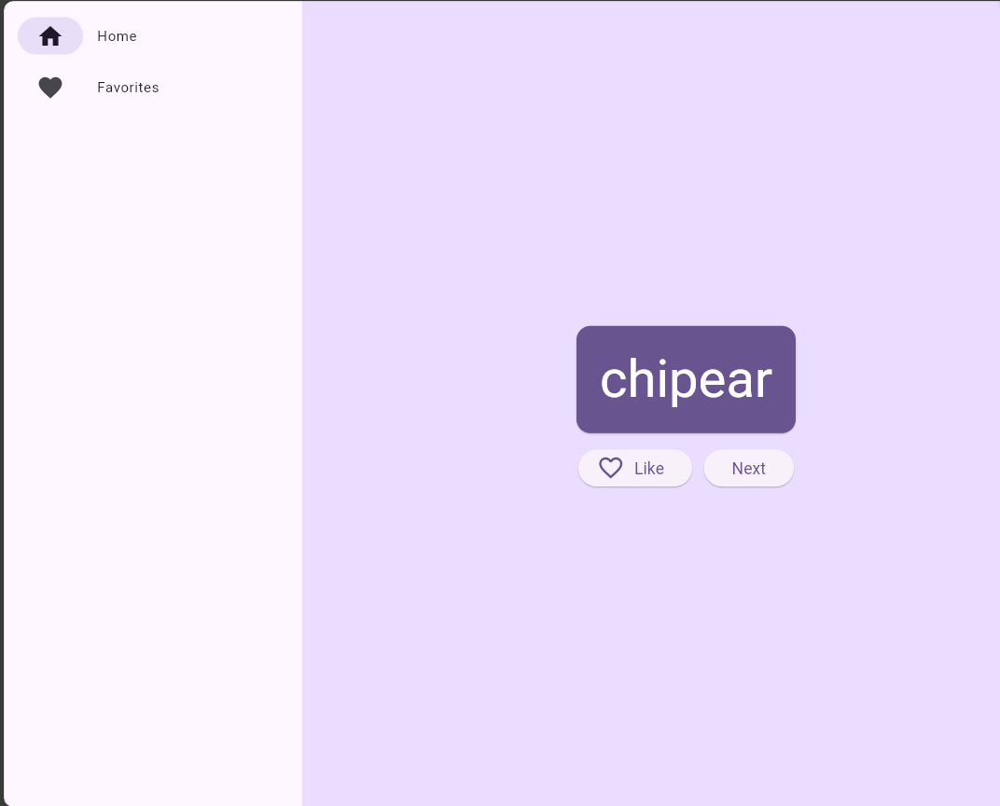

# Namer App

This is my first Flutter app. It generates cool-sounding names, such as "newstay", "lightstream", "mainbrake", or "graypine". Users can ask for the next name, favorite the current one, and review the list of favorite names on a separate page. The app is responsive for different screen sizes.

This is how it looks like:

